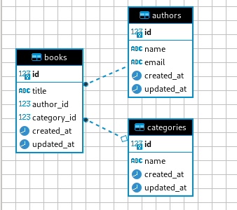

# LaraApiBooks

LaraApiBooks is a Laravel Sail application designed for a Books API, emphasizing optimized usage by implementing Nginx and FastCGI Process Manager (FPM) while utilizing containers. The architecture is prepared for deployment with a focus on performance and scalability.

## Getting Started
- Clone this repository.
- Set up your Laravel application code in the ${APP_CODE_PATH_HOST} directory.
- Configure environment variables in the .env file.
- Run the development environment: docker-compose up -d.
- Access your Laravel application at http://localhost.
- Implementing Nginx
- To set up Nginx configurations, run the following command:

```
./vendor/bin/sail artisan sail:publish
```

This command generates a docker file. The Nginx and PHP-FPM configurations are based on acadea/laravel-sail-nginx-php-fpm. Refer to this Medium article for additional guidance.

## Why is Nginx Important?
Nginx plays a pivotal role in optimizing the performance and deployment of LaraApiBooks. Key reasons include:

### Efficient Web Server:

Nginx efficiently handles incoming HTTP requests and excels at serving static content, making it ideal for production environments.

### Reverse Proxy Capability:

Acting as a reverse proxy, Nginx directs requests to the appropriate backend service (PHP-FPM), improving overall architecture.

### Load Balancing:
Nginx can be configured as a load balancer, ensuring better performance, scalability, and fault tolerance by distributing incoming traffic.

### Static Content Optimization:
Known for serving static content efficiently, Nginx reduces the load on the PHP application server.

### Security Features:
Nginx provides robust security features, including rate limiting, access control, and SSL/TLS support, enhancing the overall security of your application.

### Configuration Flexibility:
The flexible configuration system of Nginx allows tailoring its behavior to the specific needs of your application, providing a customizable and powerful solution.

In summary, Nginx is a critical component for optimizing the performance, security, and scalability of LaraApiBooks. By seamlessly integrating Nginx, you enhance the capabilities of your Laravel Sail application, making it well-suited for a production-ready Books API.

## Why Use FPM?
FastCGI Process Manager (FPM) is essential for efficient PHP processing. FPM is a robust implementation of the FastCGI protocol, providing a high-performance alternative to traditional PHP CGI. It excels in handling concurrent PHP requests, making it an ideal choice for web applications with varying workloads.

FPM enhances the overall responsiveness and resource utilization of your PHP application by:

### Concurrent Request Handling:
FPM efficiently manages multiple PHP processes simultaneously, allowing for concurrent request processing without compromising performance.

### Resource Optimization:
By intelligently allocating and reusing PHP processes, FPM minimizes resource consumption, optimizing memory usage and overall server performance.

### Improved Response Times:
FPM's ability to handle multiple requests concurrently ensures faster response times for end-users, leading to a more responsive and efficient web application.

### Scalability:
FPM's architecture supports horizontal scaling, allowing you to scale your application by adding more PHP-FPM workers to handle increased traffic and workloads.

## Data
The focus is on Nginx, FPM, and Docker, for a good deployment and management of the infrastructure. Additionally, LaraApiBooks includes data about Books, Authors, and Categories.




### Data Model

`Books`:

- title: Represents the title of the book.
- author_id: A foreign key referencing the Authors entity, establishing a relationship between books and their respective authors.
- category_id: A foreign key referencing the Categories entity, associating books with specific categories.
Relationships:

`Authors`:

- name: Represents the name of the author.
- email: Represents the email address of the author.

`Categories`:

- name: Represents the name of the category or genre.

`Author Relationship`: 

Each book is associated with a single author through the author_id foreign key.

Category Relationship: Books are categorized under specific genres through the category_id foreign key.

`Books Relationship`:

An author can be associated with multiple books.

This relationship is established through the author_id foreign key in the Books entity.

`Relationships`:

- Books Relationship: A category can encompass multiple books. This relationship is established through the category_id foreign key in the Books entity.

- Relational Model:
The relationships between these entities form a relational model that enables you to efficiently query and organize data.

### Example Queries:
Here are some example routes you can explore in your LaraApiBooks application:

`List all books`:

- http://localhost/api/books

`Show details of a specific book`:

- http://localhost/api/books/{book_id}

`List all authors`:

- http://localhost/api/authors

`Show details of a specific author`:

- http://localhost/api/authors/{author_id}

`List all categories`:

- http://localhost/api/categories

`Show details of a specific category`:

- http://localhost/api/categories/{category_id}